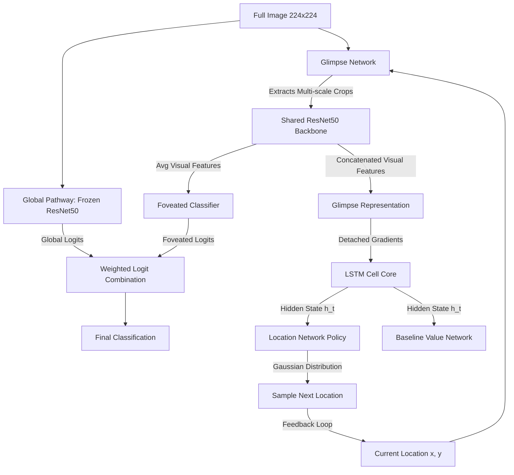

# Recurrent Attention RL Agent: Technical Documentation

This document provides a detailed, comprehensive technical breakdown of the Reinforcement Learning (RL) hard-attention agent implemented in `src/models/rl_attention.py` and trained via `src/experiments/runner.py`.

---

## 1. Overview & Motivation

In traditional feedforward vision models (e.g., standard ResNets, ViTs), the entire image is processed at a uniform resolution. While effective, this approach is computationally expensive and differs fundamentally from human vision, which relies on **selective, foveated attention**.

The `RecurrentAttentionModel` (RAM) implemented in this codebase simulates cortical feedback by processing images sequentially over a series of discrete time steps (glimpses). At each step, the agent:
1. Extracts a localized, multi-scale **glimpse** centered on a dynamic 2D coordinate.
2. Updates its **internal recurrent memory** of the visual scene.
3. Emits a **classification prediction** and decides **where to look next** (the next fixation coordinate).

This allows the model to prioritize shape-defining features and ignore distracting background, texture, or color cues.

---

## 2. Architecture & Components

The model consists of five primary neural sub-networks integrated into a unified recurrent architecture.



### A. Glimpse Network (`GlimpseNetwork`)
The Glimpse Network acts as the agent's "eye." It extracts a foveated representation centered on a dynamic 2D coordinate $\vec{l}_t \in [-1, 1]^2$.

#### Multi-Scale Extraction
To provide both high-resolution local details and lower-resolution global context, the network extracts patches at multiple scales (e.g., `num_scales=3`):
* **Scale 0 (1.0)**: Captures the entire image, providing global contextual cues.
* **Scale 1 (0.5)**: Captures a mid-range patch centered at the fixation point.
* **Scale 2 (0.25)**: Captures a high-resolution, highly foveated crop.

#### Differentiable Grid Sampling
The crops are extracted using bilinear grid sampling (`F.affine_grid` and `F.grid_sample`), which allows spatial translation gradients to flow through the crop extraction mechanism:

```python
scale_factor = 1.0 / (2 ** scale)
theta = torch.zeros(images.size(0), 2, 3, device=images.device)
theta[:, 0, 0] = scale_factor
theta[:, 1, 1] = scale_factor
theta[:, :, 2] = locs  # Translate to fixation point
grid = F.affine_grid(theta, (images.size(0), images.size(1), self.patch_size, self.patch_size), align_corners=False)
patch = F.grid_sample(images, grid, align_corners=False)
```

#### Shared Backbone & Projection
1. The extracted patches are downsampled to a uniform resolution (e.g., $48 \times 48$) and fed through a shared **ResNet50** backbone.
2. To preserve pre-trained ImageNet representations while adapting to foveated patches, early layers are frozen, while `layer4` is unfrozen and fine-tuned.
3. The visual features across scales (each 2048-dimensional) are concatenated and projected via a fully connected layer:
   $$\phi_{\text{img}} = \text{ReLU}(W_{\text{img}} \cdot \text{concat}(g_1, g_2, \dots) + b_{\text{img}})$$
4. The location coordinates are projected:
   $$\phi_{\text{loc}} = \text{ReLU}(W_{\text{loc}} \cdot \vec{l}_t + b_{\text{loc}})$$
5. The final glimpse representation is a combined projection:
   $$\phi(\vec{l}_t, I_t) = \text{ReLU}(W_{\text{out}} \cdot [\phi_{\text{img}}; \phi_{\text{loc}}] + b_{\text{out}})$$

---

### B. Recurrent Core (`nn.LSTMCell`)
The recurrent core maintains an internal state representing the agent's memory of what it has seen so far.
* **Input**: The glimpse representation $\phi(\vec{l}_t, I_t)$.
* **State Update**: At each step $t$, the LSTM updates its hidden state $\vec{h}_t$ and cell state $\vec{c}_t$:
  $$\vec{h}_t, \vec{c}_t = \text{LSTM}(\phi(\vec{l}_t, I_t), (\vec{h}_{t-1}, \vec{c}_{t-1}))$$
* **Gradient Isolation**: To prevent policy gradients from corrupting the CNN feature extractor, the glimpse representation is detached before entering the LSTM (`g_t_concat.detach()`). The LSTM and policy networks are trained via policy gradients, while the CNN is trained via classification gradients.

---

### C. Location Network / Policy (`LocationNetwork`)
The Location Network is the policy network that decides where the agent should focus its attention next.
* **Mean Prediction**: A linear layer maps the hidden state $\vec{h}_t$ to a 2D mean vector $\vec{\mu}_t$, bounded to $[-1, 1]^2$ using a `tanh` activation:
  $$\vec{\mu}_t = \tanh(W_{\text{loc\_net}} \cdot \vec{h}_t + b_{\text{loc\_net}})$$
* **Policy Distribution**: The policy is modeled as a 2D Gaussian distribution with a fixed standard deviation $\sigma$ (e.g., $0.22$):
  $$\pi(\vec{l}_t | \vec{h}_t) \sim \mathcal{N}(\vec{\mu}_t, \sigma^2 \mathbf{I})$$
* **Sampling**:
  * **Training**: Locations are sampled from the Gaussian distribution to encourage exploration, and then clamped to $[-1, 1]$.
  * **Evaluation**: The agent acts deterministically by using the mean $\vec{\mu}_t$ directly.

---

### D. Baseline Network
To reduce the high variance of policy gradient updates, a baseline network estimates the expected future return:
$$V(\vec{h}_t) = W_{\text{baseline}} \cdot \vec{h}_t + b_{\text{baseline}}$$
This value estimate is used in both the A2C and PPO advantage calculations.

---

### E. Dual-Pathway Classification
To combine global context with dynamic foveated attention, the agent uses a dual-pathway architecture:
1. **Foveated Pathway**: A trainable classifier processes the average visual feature across glimpses to output foveated logits.
2. **Global Pathway**: A completely frozen ResNet50 + classifier processes the full image ($224 \times 224$), acting as a stable base accuracy that is never corrupted by training.
3. **Combined Logits**: The final classification logits are a weighted average:
   $$\text{Logits}_{\text{final}} = 0.5 \cdot \text{Logits}_{\text{global}} + 0.5 \cdot \text{Logits}_{\text{foveated}}$$

---

## 3. Reinforcement Learning Mechanics

### A. Environment Reward Structure
The agent is trained in an environment with a **sparse, terminal reward**:
* The agent receives a reward of **$+1.0$** at the final step $T$ if its final classification matches the **primary shape class** (`class1`) of the composite image.
* It receives a reward of **$0.0$** otherwise.

This reward structure forces the location policy to specifically seek out shape-defining features rather than being distracted by background, texture, or color.

---

### B. Loss Functions & Objectives

The total loss optimized during training is:
$$\mathcal{L}_{\text{total}} = \mathcal{L}_{\text{RL}} + \mathcal{L}_{\text{Classification}}$$

The RL loss can be computed using one of two policy gradient algorithms:

#### 1. Advantage Actor-Critic (A2C)
A2C computes a Temporal Difference (TD) advantage at each step using the Bellman equation:
$$A_t = R_t + \gamma V_{t+1} - V_t$$
where $R_t = 0$ for $t < T-1$, and $R_{T-1} = \text{terminal reward}$.

* **Policy Loss**: Encourages actions that led to higher-than-expected returns:
  $$\mathcal{L}_{\text{policy}} = - \frac{1}{T} \sum_{t=1}^T \log \pi(\vec{l}_t | \vec{h}_t) \cdot A_t$$
* **Value Loss**: Minimizes the Mean Squared Error (MSE) between the predicted baseline value and the actual discounted return:
  $$\mathcal{L}_{\text{value}} = \frac{1}{T} \sum_{t=1}^T (V_t - G_t)^2$$
* **Entropy Bonus**: Added to prevent premature policy convergence and encourage exploration:
  $$\mathcal{L}_{\text{entropy}} = - \beta \frac{1}{T} \sum_{t=1}^T \mathcal{H}(\pi(\vec{l}_t | \vec{h}_t))$$

#### 2. Proximal Policy Optimization (PPO)
PPO stabilizes training by bounding policy updates using a clipped surrogate objective:
$$\mathcal{L}_{\text{CLIP}}(\theta) = - \hat{\mathbb{E}}_t \left[ \min(r_t(\theta)\hat{A}_t, \text{clip}(r_t(\theta), 1-\epsilon, 1+\epsilon)\hat{A}_t) \right]$$
where $r_t(\theta) = \frac{\pi_\theta(\vec{l}_t | \vec{h}_t)}{\pi_{\theta_{\text{old}}}(\vec{l}_t | \vec{h}_t)}$ is the probability ratio.

---

## 4. Ensemble Modeling (`RecurrentAttentionEnsemble`)

To mitigate the high variance inherent in RL hard-attention models, the architecture supports ensembling:
* **Ensemble Prediction**: It runs $N$ distinct attention agents simultaneously.
* During evaluation, instead of averaging raw logits, it averages the predicted probabilities (which is mathematically more robust):
  $$\vec{p}_{\text{avg}} = \frac{1}{N} \sum_{i=1}^N \text{Softmax}(\text{Logits}_i)$$
  $$\text{Logits}_{\text{avg}} = \log(\vec{p}_{\text{avg}} + 10^{-8})$$
* During training, it returns stacked tensors to allow independent loss computation for each model in a single parallelized forward/backward pass.

---

## 5. Training Pipeline & Hyperparameters

The agent is trained in `src/experiments/runner.py` with the following key configurations:

| Hyperparameter | Value | Description |
| :--- | :--- | :--- |
| **Patch Size** | 48 | Resolution of each extracted crop |
| **Num Glimpses** | 8 | Sequence length (steps) per image |
| **Hidden Dim** | 512 | Dimension of the LSTM hidden state |
| **Optimizer** | Adam | Optimizes all parameters |
| **Learning Rate** | $2 \times 10^{-4}$ | Initial learning rate |
| **Scheduler** | CosineAnnealingLR | Decays learning rate to 0 |
| **Gradient Clipping** | 0.5 | Max norm for gradient clipping |
| **Early Stopping** | Patience = 5 | Captures peak validation accuracy |
