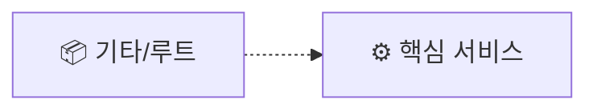

# 📊 프로젝트 종합 평가 보고서

> 이 문서는 Vibe Coding Report VS Code 확장에서 자동으로 관리됩니다.

---

## 📝 요약(한눈에)

<!-- AUTO-TLDR-START -->
| 항목 | 내용 |
|:---|:---|
| **전체 등급** | - |
| **전체 점수** | -/100 |
| **가장 큰 리스크** | - |
| **권장 최우선 작업** | - |
<!-- AUTO-TLDR-END -->

---

## ⚠️ 리스크 요약

<!-- AUTO-RISK-SUMMARY-START -->
| 리스크 레벨 | 항목 | 관련 개선 ID |
|------------|------|-------------|
| - | - | - |
<!-- AUTO-RISK-SUMMARY-END -->

---

<!-- AUTO-OVERVIEW-START -->
## 📋 프로젝트 개요

| 항목 | 값 |
|------|-----|
| **프로젝트명** | composite_vision_research |
| **버전** | - |
| **최초 분석일** | 2026-06-17 16:59 |
| **최근 분석일** | 2026-06-17 16:59 |
| **파일 수** | 5000 |
| **디렉토리 수** | 22 |
| **주요 언어** | Python |
| **프레임워크** | - |
<!-- AUTO-OVERVIEW-END -->

---

<!-- AUTO-STRUCTURE-START -->
## 📐 프로젝트 구조

### 📐 기능 기반 프로젝트 구조

**프로젝트**: `composite_vision_research`
**타입**: 📦 일반 프로젝트

#### 기능 그룹 요약

| 그룹 | 대표 영역 | 파일 수 |
|:---|:---|:---:|
| ⚙️ **핵심 서비스** | models | 4 |
| 📦 **기타/루트** | 루트/기타 | 4996 |

#### 대표 진입점
- _(엔트리포인트 자동 감지 실패)_

#### 구조 흐름

<!-- AUTO-STRUCTURE-END -->

---

<!-- AUTO-SCORE-START -->
## 📊 종합 점수 요약

| 항목 | 점수 (100점 만점) | 등급 | 변화 |
|------|------------------|------|------|
| **코드 품질** | - | - | - |
| **아키텍처 설계** | - | - | - |
| **보안** | - | - | - |
| **성능** | - | - | - |
| **테스트 커버리지** | - | - | - |
| **에러 처리** | - | - | - |
| **문서화** | - | - | - |
| **확장성** | - | - | - |
| **유지보수성** | - | - | - |
| **프로덕션 준비도** | - | - | - |
| **총점 평균** | **-** | **-** | - |

*첫 번째 분석 후 점수가 표시됩니다.*
<!-- AUTO-SCORE-END -->

---

## 🔗 점수 ↔ 개선 항목 매핑

<!-- AUTO-SCORE-MAPPING-START -->
| 카테고리 | 현재 점수 | 주요 리스크 | 관련 개선 항목 ID |
|----------|----------|------------|------------------|
| - | - | - | - |
<!-- AUTO-SCORE-MAPPING-END -->

---

<!-- AUTO-DETAIL-START -->
## 🔍 기능별 상세 평가

*첫 번째 분석 후 상세 평가가 표시됩니다.*
<!-- AUTO-DETAIL-END -->

---

<!-- AUTO-SUMMARY-START -->
## 📈 현재 상태 요약

*첫 번째 분석 후 요약이 표시됩니다.*
<!-- AUTO-SUMMARY-END -->

---

<!-- AUTO-TREND-START -->
## 📈 버전별 점수 추이

| 버전 | 날짜 | 총점 | 주요 변경 |
|------|------|------|----------|
| - | - | - | - |

*버전 업데이트 시 점수 추이가 기록됩니다.*
<!-- AUTO-TREND-END -->
