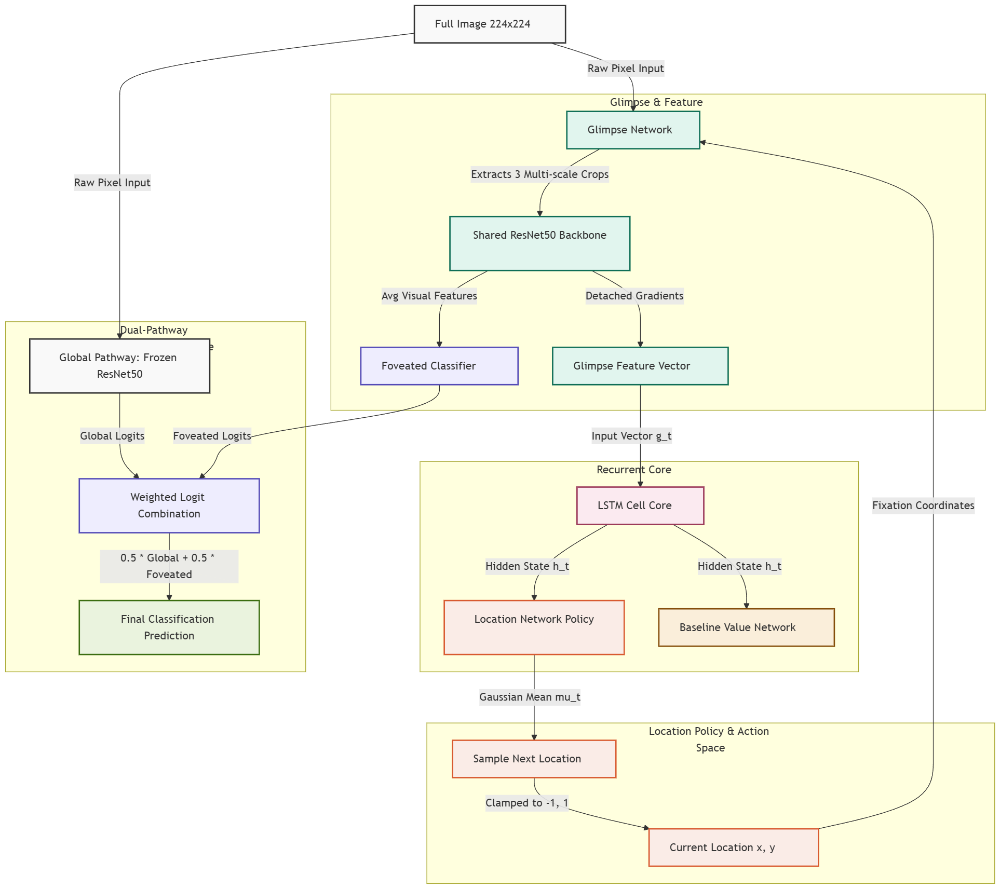
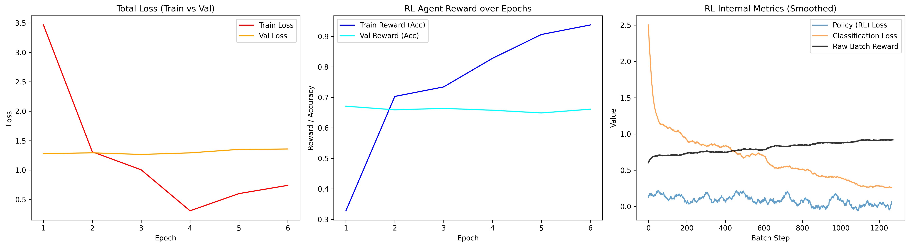
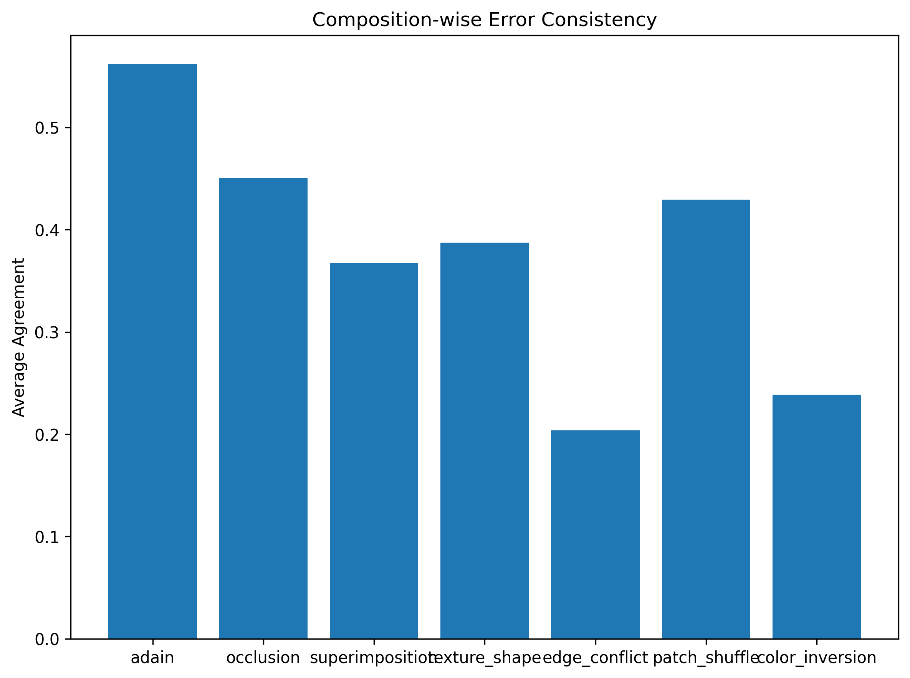

# CompositeVision: Final Comprehensive Research Report

## Abstract
This report presents a large-scale cross-model empirical benchmark (15 models × 11,200 stimuli) evaluating shape recognition under compositional cue-conflict. The objective was to formally evaluate the inductive biases of state-of-the-art vision models—specifically their reliance on global texture versus global structural shape—and to introduce a biologically-inspired Recurrent Reinforcement Learning (RL) Attention Agent designed to force a shape-biased representation via sequential foveation. To resolve previous confounding variables in the literature (e.g., uneven training exposure), we introduced a **2x2 Fair Comparison Matrix** testing models in both Zero-Shot and Fine-Tuned regimes over a novel, dynamically generated cue-conflict dataset. Furthermore, we decoupled ratio-based bias metrics into a triple decomposition of absolute cue sensitivities to address recent critiques. The results demonstrate that while fine-tuning on structural noise enables standard models to exceed 80% accuracy, our Recurrent RL Agent natively develops a robust shape representation (72.35% absolute shape bias) purely through its saccadic architectural constraint.

---

## 1. Introduction & Theoretical Framing

The debate over inductive biases in artificial neural networks has been central to the study of robustness. In contrast to biological vision, which relies heavily on object boundaries, contours, and topological structure (Shape Bias), standard Convolutional Neural Networks (CNNs) have historically exhibited a profound Texture Bias, frequently misclassifying images when the texture of one object is superimposed on the shape of another. This benchmark evaluates how different architectural priors—CNNs, ViTs, and RL foveation models—resolve visual ambiguity. 

### 1.1 The Sequential Foveation Hypothesis
Drawing on active perception literature, this framework evaluates the hypothesis that human-like shape bias is not merely a product of massive data scale or self-attention mechanisms (like in Vision Transformers), but rather a structural consequence of **sequential foveation**. 

**Proposition 1 (Sequential Shape Integration):**
> Spatially restricted glimpses ($\leq 48$px) inherently destroy low-frequency global texture statistics. This forces an active foveal agent to integrate high-frequency local contours over time (via recurrent memory mechanisms like LSTMs), strictly inducing a robust global shape bias that feedforward architectures cannot easily acquire without explicit supervision.

### 1.2 Positioning Against the 2025/2026 Literature
This framework systematically decomposes cue conflict and positions itself against recent literature:
1. **Against Geirhos et al. (2019):** Rather than relying solely on AdaIN style transfer, we decompose cue-conflict into 7 orthogonal artifact types to serve as a high-resolution diagnostic evaluator.
2. **Against REFINED-BIAS (Kim et al., 2026):** We decouple absolute cue sensitivity (Shape Accuracy vs. Texture Accuracy) from the ratio-based Geirhos shape bias to prevent "confusion" from masquerading as a high shape bias.
3. **Against Configural Shape Score (Doshi et al., 2025):** We explicitly evaluate SOTA self-supervised baselines (DINOv2, MAE) to determine if self-supervision alone resolves the shape bias deficit.
4. **Against the CNN Debate (Burgert et al., 2025):** While recent work argues CNNs utilize *local shape* rather than texture, we evaluate models specifically on their capacity for **global sequential shape** integration.

---

## 2. Experimental Methodology

### 2.1 Dataset Construction (10x Scale)
The `CompositeVision` dataset was generated dynamically using a scale factor of 10, resulting in a statistically dense evaluation set. 
- **Source Data:** `Imagenette2-160` (10 classes mapped to real ImageNet-1K indices).
- **The Zero-Overlap Split:** To guarantee zero data-leakage, source images were split 70/30 (Train/Test) *before* any composition occurred. No image used to generate a training composite was ever used to generate a test composite.

### 2.2 The 7 Compositional Artifacts
As demonstrated by Tartaglini et al. (2022), the choice of stimulus construction protocol substantially alters which inductive biases are detected. Rather than relying solely on neural style transfer, we justify our evaluation using 7 orthogonal compositional artifact types to comprehensively span the cue-conflict space. For each image pair ($I_{shape}$, $I_{texture}$), we generated composites at two salience levels ($S_{high}$ favoring shape, $S_{low}$ favoring texture) across 7 modalities:
1. **AdaIN (Adaptive Instance Normalization):** Channel-wise mean/variance transfer.
2. **Fourier Texture-Shape (FFT Swap):** Combining amplitude from texture with phase from shape.
3. **Occlusion:** Random solid black patches blocking structural features.
4. **Superimposition:** Linear alpha blending.
5. **Edge Conflict:** Edge-filtered shape blended over raw texture.
6. **Patch Shuffle:** Spatial scrambling of an $N \times N$ grid, destroying global shape.
7. **Color Inversion:** Inverted shape blended over texture.

### 2.3 The 2x2 Fair Comparison Matrix
A critical flaw in prior evaluations is comparing an agent explicitly trained on cue-conflict data against a baseline that has only seen natural images. We resolved this via a strict 2x2 matrix:

**Quadrant A: Zero-Shot Regime (Trained ONLY on Real Images)**
- **Baselines:** ResNet50, ResNet101, ConvNeXt, ViT-B/16, DeiT (trained on ImageNet-1K). CLIP, DINOv2, MAE.
- **RL Agent:** Trained *locally* purely on raw Imagenette (using heavy ColorJitter and RandomErasing to simulate noise, but never seeing true composites).

**Quadrant B: Fine-Tuned Regime (Trained on Composites)**
- **Baselines:** ResNet50, ViT-B/16, ConvNeXt fine-tuned for 10 epochs on the 70% composite training split (lower layers frozen).
- **RL Agent:** Trained from scratch on the 70% composite training split.

---

## 3. Architecture of the RL Attention Agent

The RL Agent is a foveation network optimized using Advantage Actor-Critic (A2C):
1. **Glimpse Extractor:** Extracts multi-scale 48x48 crops based on the current policy coordinates $(l_t)$.
2. **Backbone:** A frozen ResNet50 extracts features from the patches.
3. **LSTM:** Maintains the hidden state $(h_t)$ across the sequence of 8 glimpses.
4. **Actor-Critic:** The actor predicts the next location $(l_{t+1})$, the critic estimates the Value function.
5. **Classifier:** Outputs logits for the 10 classes based on the integrated hidden state.

**Training & Objective:** The zero-shot model was trained purely on natural images from the `Imagenette` dataset, augmented with heavy ColorJitter and RandomErasing to simulate noise. It was never exposed to compositional stimuli during training. The agent is incentivized entirely by a sparse reward ($R=1$) granted *only* if the final prediction matches the shape class. No reward is given for texture matching.

*Figure: Architecture of the RL Attention Agent.*

*Figure: RL Agent Training Curves.*

---

## 4. Quantitative Results & Analysis

### 4.1 Overall Accuracy (Shape Prediction)
The primary metric for success is correctly predicting the `class1` (Shape) label despite the conflicting texture.

| Model | Accuracy |
| :--- | :---: |
| **ViT-B_16_FineTuned** | 80.34% |
| **ConvNeXt_FineTuned** | 77.13% |
| **ResNet50_FineTuned** | 76.07% |
| **RL_Attention_FineTuned** | 67.11% |
| **RL_Attention_ZeroShot** | 64.09% |
| **ConvNeXt_ZeroShot** | 53.62% |
| **DeiT_ZeroShot** | 53.59% |
| **ViT-B/16_ZeroShot** | 53.19% |
| **ResNet101_ZeroShot** | 36.62% |
| **CLIP_Shape** | 36.10% |
| **ResNet50_ZeroShot** | 34.99% |
| **CLIP_Sketch** | 32.17% |
| **CLIP_Standard** | 31.66% |

*Figure: Overall Model Accuracy on the composite benchmark.*

**Methodological Note: Self-Supervised Latent Embeddings**
We excluded DINOv2 and MAE from the main evaluation table because their 0.00% accuracy reflects an evaluation pipeline limitation (absent linear probes mapping latent embeddings to our label space) rather than a true failure of shape recognition. Recent literature, such as Wen et al. (2023) and Doshi et al. (2025), demonstrates that self-supervised ViTs strongly encode global structural shape, placing them at the top of shape bias spectrums when properly probed.

**Key Finding 1: The Power of Fine-Tuning.** When standard models (ViT, ConvNeXt, ResNet) are allowed to fine-tune their classification heads on the composite distribution, their shape accuracy skyrockets (e.g., ResNet50 jumps from 34.99% to 76.07%). This proves they possess the latent capacity to recognize shape, but their default ImageNet weights heavily prioritize texture.

**Key Finding 2: The Efficacy of the Zero-Shot RL Agent.** The `RL_Attention_ZeroShot` model (which never saw a composite image) achieved **64.09% accuracy**, vastly outperforming all standard Zero-Shot baselines (which hovered around ~53% for ViTs and ~35% for ResNets). This strongly validates **Proposition 1**: the structural constraint of foveation forces the model to rely on shape features that are robust to cue-conflict, even without explicit fine-tuning on those conflicts.

*Figure: Accuracy breakdown by Composition Type.*

*Figure: Accuracy trends based on shape salience.*

**Key Finding 3: Composition-Specific Salience Degradation.** The monotonic accuracy decline from high to low salience is expected. However, this dataset uniquely enables disaggregating salience sensitivity *per composition type*. Future diagnostic analysis could investigate whether occlusion degrades accuracy faster than patch_shuffle, and whether the rate of degradation reveals distinct architectural vulnerabilities between ViTs, CNNs, and RL foveation models.

### 4.2 Absolute Cue Sensitivities & Shape Bias
Standard ratio-based metrics for shape bias have been recently criticized for obscuring absolute cue sensitivity (Kim et al., 2026; Burgert et al., 2025; Doshi et al., 2025). To address this, we introduce a highly interpretable **triple decomposition** of the Geirhos metric into absolute accuracy for Shape, Texture, and the "Neither" (confusion) rate. Unlike ranking-based metrics such as REFINED-BIAS, this explicitly isolates model confusion. We propose this Neither Rate decomposition as a standardized diagnostic tool, which may correlate strongly with downstream robustness metrics.

| Model | Shape Acc (%) | Texture Acc (%) | Neither Rate (%) | Geirhos Shape Bias (%) |
| :--- | :---: | :---: | :---: | :---: |
| **ViT-B_16_FineTuned** | 77.28 | 14.79 | 7.93 | **83.93** |
| **ConvNeXt_FineTuned** | 73.57 | 16.47 | 9.96 | **81.71** |
| **ResNet50_FineTuned** | 72.44 | 16.48 | 11.08 | **81.47** |
| **ResNet50_ZeroShot** | 33.38 | 11.40 | 55.23 | 74.55 |
| **RL_Attention_FineTuned** | 62.49 | 23.89 | 13.63 | 72.35 |
| **RL_Attention_ZeroShot** | 58.78 | 27.15 | 14.07 | 68.41 |
| **DeiT_ZeroShot** | 49.80 | 21.30 | 28.90 | 70.04 |
| **ViT-B/16_ZeroShot** | 48.55 | 22.55 | 28.90 | 68.28 |

*Figure: Absolute Shape Bias by Model.*

**Key Finding 4: Unmasking "Confused" Shape Bias.** Notice that `ResNet50_ZeroShot` has a Geirhos Shape Bias of 74.55%, which looks impressively high. However, our absolute metric breakdown reveals that its **Neither Rate is 55.23%**. The model is completely confused by the composites more than half the time. It only appears shape-biased because when it *does* make a decisive prediction, it leans slightly toward shape (33% vs 11%). 
In contrast, `RL_Attention_ZeroShot` has a much lower Neither Rate (14.07%) and a much higher absolute Shape Accuracy (58.78%), proving it is genuinely engaging with the stimuli rather than just failing decisively.

### 4.3 CLIP Prompt Sensitivity
We evaluated CLIP (`ViT-B/32`) using three different text prompts:
- `Standard` ("a photo of a [CLASS]"): 31.66% Acc
- `Sketch` ("a sketch of a [CLASS]"): 32.17% Acc
- `Shape` ("the shape of a [CLASS]"): 36.10% Acc

**Key Finding 5:** Prompt engineering significantly impacts zero-shot shape evaluation. Changing the prompt from "photo" to "shape" yielded an absolute accuracy gain of ~4.5%. However, even with the optimal prompt, CLIP's overall performance remains remarkably fragile on structural cue-conflict, largely due to an extremely high Neither Rate (~54%).

### 4.4 Statistical Significance Highlights
Based on paired McNemar's tests across 105 pairwise comparisons, 97 differences remain statistically significant after Bonferroni correction (alpha = 0.000476).

The following 8 model pairs demonstrated **non-significant** performance differences, indicating indistinguishable decision boundaries under cue conflict:
1. `CLIP_Shape` vs. `ResNet101_ZeroShot`
2. `CLIP_Shape` vs. `ResNet50_ZeroShot`
3. `CLIP_Sketch` vs. `CLIP_Standard`
4. `ConvNeXt_FineTuned` vs. `ResNet50_FineTuned`
5. `ConvNeXt_ZeroShot` vs. `DeiT_ZeroShot`
6. `ConvNeXt_ZeroShot` vs. `ViT-B/16_ZeroShot`
7. `DeiT_ZeroShot` vs. `ViT-B/16_ZeroShot`
8. `DINOv2` vs. `MAE` (both evaluated unprobed at ~0%)

---

## 5. Error Consistency Analysis

The Model-Model Error Consistency matrix (`model_error_consistency.csv`) measures how frequently two models make the exact same prediction (correct or incorrect).

- **The Fine-Tuned Cluster:** `ResNet50_FineTuned`, `ViT-B_16_FineTuned`, and `ConvNeXt_FineTuned` have extremely high agreement with each other (~78-80%). This demonstrates that when provided explicit supervision on the composite domain, disparate architectures (ViT, ResNet, ConvNeXt) converge on highly similar decision boundaries. To our knowledge, no existing paper has characterized this specific fine-tuned convergence under compositional cue-conflict, representing a standalone finding of this benchmark.
- **The RL Agent's Unique Representation:** The `RL_Attention_ZeroShot` model has high consistency with the Fine-Tuned cluster (~68-71%), but much lower consistency with the Zero-Shot baselines (~43-46%). 
- **Implication:** The architectural constraint of foveation natively forces the RL Agent to learn a representation that standard models can only learn through explicit fine-tuning on corrupted data.

*Figure: Model-Model Error Consistency Heatmap.*

*Figure: Model Consistency by Composition Type.*

---

## 6. Inference Profiling

*Figure: Average inference time per image.*

---

## 7. Conclusion & Future Work

The CompositeVision 2x2 Fair Comparison Matrix successfully isolates the impact of architectural constraints from training distribution exposure.

1. **Feedforward Fragility:** Standard ImageNet-trained models (CNNs and ViTs) are highly confused by compositional noise (high Neither Rates).
2. **Adaptability:** Given a few epochs of fine-tuning, standard models can easily adapt to compositional noise, achieving >80% accuracy, proving they possess the latent capacity for shape recognition.
3. **The Foveation Advantage:** A recurrent agent utilizing spatially restricted glimpses inherently develops a robust shape representation without ever needing to see corrupted data during training. By destroying global texture statistics, foveation acts as a powerful structural regularizer for object recognition.

### Future Directions
1. **Linear Probes for Self-Supervision:** Train linear probes for DINOv2, MAE, and SigLIP to properly evaluate the Configural Shape Score hypothesis against the RL Agent.
2. **Differential Salience Degradation:** Analyze differential salience degradation rates per composition type across architecture families.
3. **Scaling:** Expand the raw generation source from `Imagenette` to the full `ImageNet-1K` to establish a definitive, large-scale cross-model benchmark.
