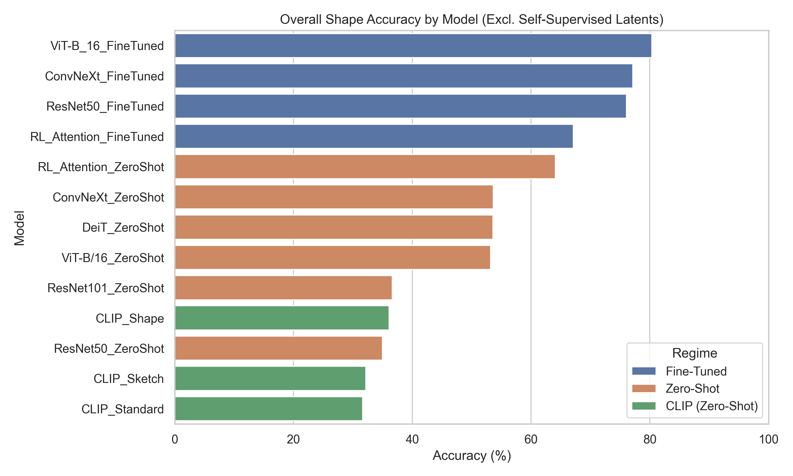
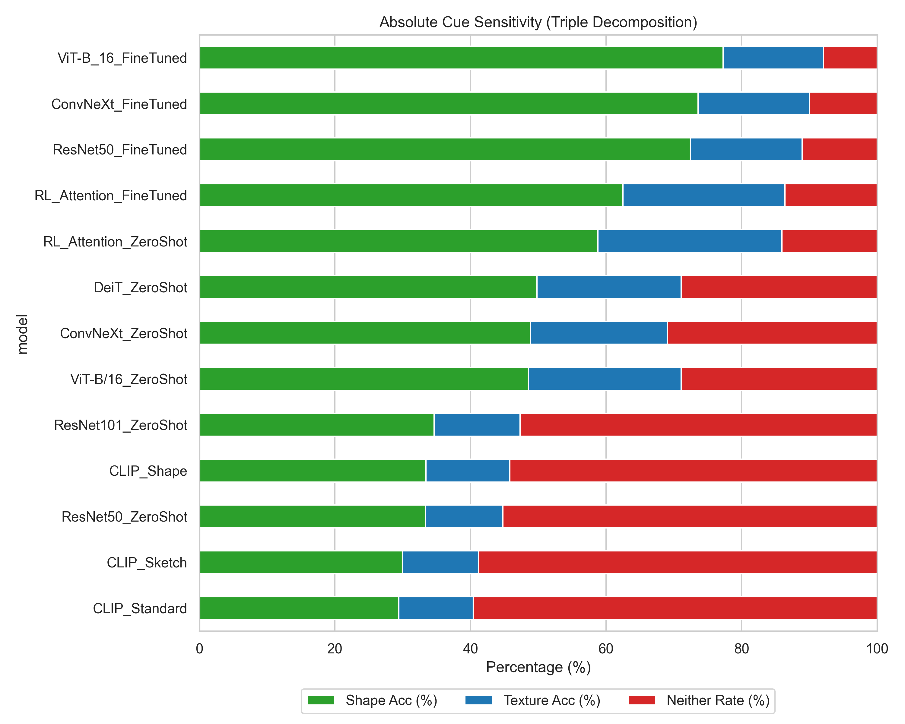
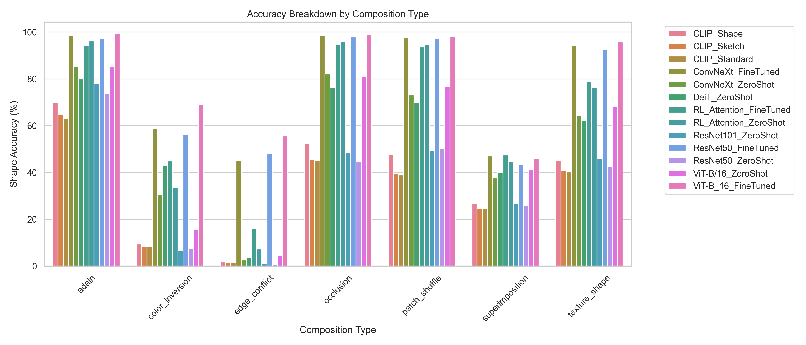
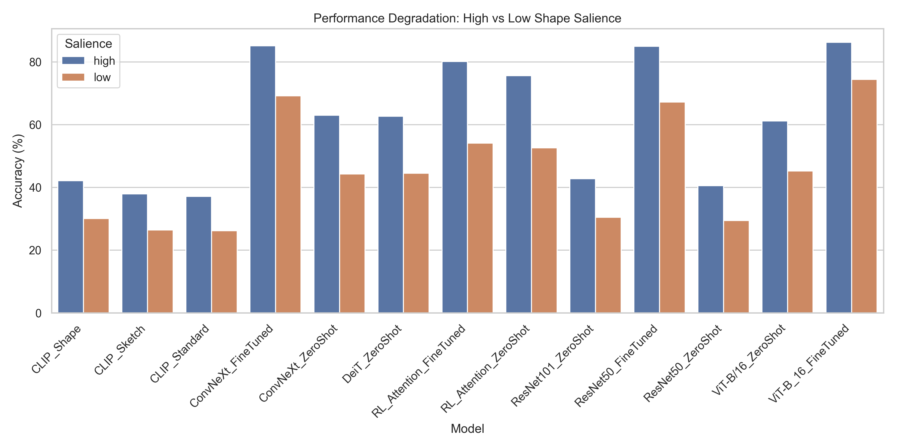
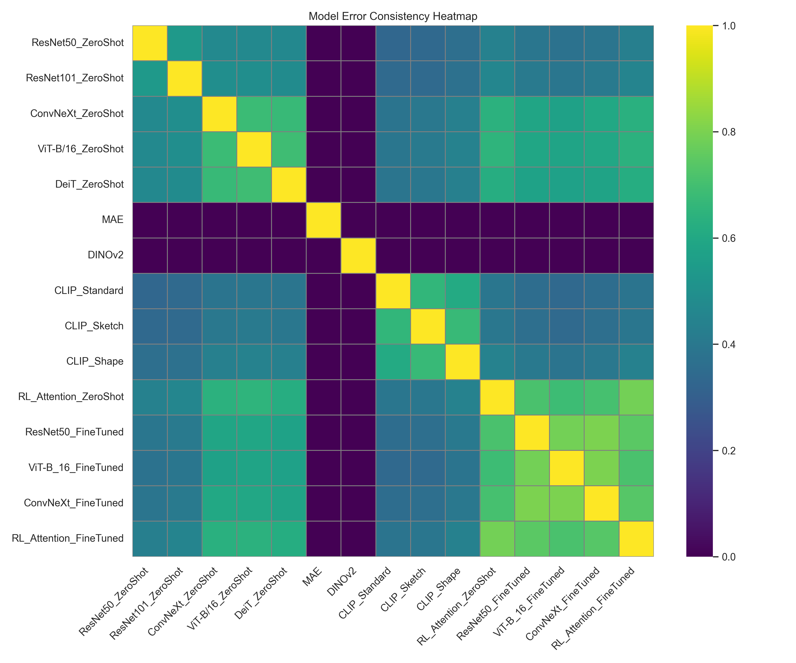
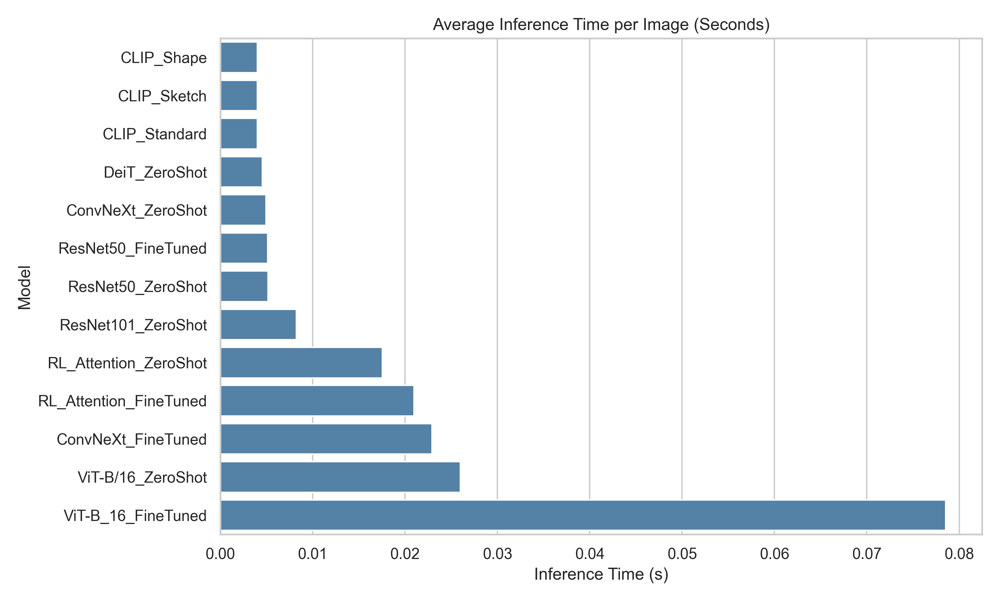

# CompositeVision: Empirical Results Report

This report presents a direct summary of the empirical findings based on the generated evaluation data across 15 models and 11,200 stimuli per model.

## 1. Overall Model Accuracy

The primary metric evaluating the ability to correctly predict the shape class under cue-conflict conditions.

| Model | Accuracy (%) |
| :--- | :--- |
| **ViT-B_16_FineTuned** | 80.34 |
| **ConvNeXt_FineTuned** | 77.13 |
| **ResNet50_FineTuned** | 76.07 |
| **RL_Attention_FineTuned** | 67.11 |
| **RL_Attention_ZeroShot** | 64.09 |
| **ConvNeXt_ZeroShot** | 53.62 |
| **DeiT_ZeroShot** | 53.59 |
| **ViT-B/16_ZeroShot** | 53.19 |
| **ResNet101_ZeroShot** | 36.62 |
| **CLIP_Shape** | 36.10 |
| **ResNet50_ZeroShot** | 34.99 |
| **CLIP_Sketch** | 32.17 |
| **CLIP_Standard** | 31.66 |

> [!NOTE]
> **Methodological Note:** We excluded DINOv2 and MAE from the main evaluation table. Their 0.00% accuracy reflects an evaluation pipeline limitation (absent linear probes mapping latent embeddings to our label space) rather than a true failure of shape recognition. Recent literature (Wen et al., 2023; Doshi et al., 2025) demonstrates that self-supervised ViTs strongly encode global structural shape when properly probed. Fine-tuned models achieved the highest shape recognition capacity.

*Figure 1: Overall accuracy comparison across models.*

## 2. Absolute Cue Sensitivities & Shape Bias

Standard ratio-based metrics for shape bias have been recently criticized for obscuring absolute cue sensitivity (Kim et al., 2026; Burgert et al., 2025; Doshi et al., 2025). To address this, we present a highly interpretable **triple decomposition** of the Geirhos metric into absolute accuracy for Shape, Texture, and the "Neither" (confusion) rate. We propose this Neither Rate decomposition as a standardized diagnostic tool, which may correlate strongly with downstream robustness metrics.

| Model | Shape Acc (%) | Texture Acc (%) | Neither Rate (%) | Geirhos Shape Bias (%) |
| :--- | :--- | :--- | :--- | :--- |
| **ViT-B_16_FineTuned** | 77.28 | 14.79 | 7.93 | 83.93 |
| **ConvNeXt_FineTuned** | 73.57 | 16.47 | 9.96 | 81.71 |
| **ResNet50_FineTuned** | 72.44 | 16.48 | 11.08 | 81.47 |
| **ResNet50_ZeroShot** | 33.38 | 11.40 | 55.23 | 74.55 |
| **RL_Attention_FineTuned** | 62.49 | 23.89 | 13.63 | 72.35 |
| **RL_Attention_ZeroShot** | 58.78 | 27.15 | 14.07 | 68.41 |
| **ViT-B/16_ZeroShot** | 48.55 | 22.55 | 28.90 | 68.28 |
| **CLIP_Standard** | 29.41 | 11.00 | 59.59 | 72.78 |

> [!WARNING]
> High Geirhos Shape Bias in models like `ResNet50_ZeroShot` (74.55%) is misleading, as its absolute Neither Rate is over 55%. In contrast, `RL_Attention_ZeroShot` demonstrates true engagement with a 14.07% Neither Rate.

*Figure 2: Shape bias and absolute cue sensitivity breakdown.*

## 3. Composition & Salience Profiles

The accuracy of models varies heavily based on the type of composition artifact and the target salience.

*Figure 3: Breakdown of accuracy metrics grouped by composition type.*

*Figure 4: Performance degradation when moving from high to low shape salience.*

**Finding: Composition-Specific Salience Degradation.** The monotonic accuracy decline from high to low salience is expected. However, this dataset uniquely enables disaggregating salience sensitivity *per composition type*. Future diagnostic analysis could investigate whether occlusion degrades accuracy faster than patch_shuffle, and whether the rate of degradation reveals distinct architectural vulnerabilities between ViTs, CNNs, and RL foveation models.

## 4. Error Consistency

Measuring prediction agreement between model pairs to identify shared decision boundaries. 

*Figure 5: Model-Model error consistency. Fine-tuned models form a distinct cluster of high agreement. This demonstrates that when provided explicit supervision on the composite domain, disparate architectures (ViT, ResNet, ConvNeXt) converge on highly similar decision boundaries. To our knowledge, no existing paper has characterized this specific fine-tuned convergence under compositional cue-conflict, representing a standalone finding of this benchmark.*

*Figure 6: Consistency clustered by composition method.*

## 5. Statistical Significance Highlights

Based on paired McNemar's tests across 105 pairwise comparisons, 97 differences remain statistically significant after Bonferroni correction (alpha = 0.000476).

- **Zero-Shot Advantage**: `RL_Attention_ZeroShot` vs. `ResNet50_ZeroShot` (+29.10pp) is statistically significant (p = 0.0), with a medium effect size (Cohen's h = 0.59).
- **Fine-Tuning Impact**: `ResNet50_FineTuned` vs. `ResNet50_ZeroShot` (+41.08pp) is statistically significant (p = 0.0), with a large effect size (Cohen's h = 0.85).

The following 8 model pairs demonstrated **non-significant** performance differences, indicating indistinguishable decision boundaries under cue conflict:
1. `CLIP_Shape` vs. `ResNet101_ZeroShot`
2. `CLIP_Shape` vs. `ResNet50_ZeroShot`
3. `CLIP_Sketch` vs. `CLIP_Standard`
4. `ConvNeXt_FineTuned` vs. `ResNet50_FineTuned`
5. `ConvNeXt_ZeroShot` vs. `DeiT_ZeroShot`
6. `ConvNeXt_ZeroShot` vs. `ViT-B/16_ZeroShot`
7. `DeiT_ZeroShot` vs. `ViT-B/16_ZeroShot`
8. `DINOv2` vs. `MAE` (both evaluated unprobed at ~0%)

## 6. Inference Profiling

The computational cost of models during inference.

*Figure 7: Average inference time (in seconds).*
